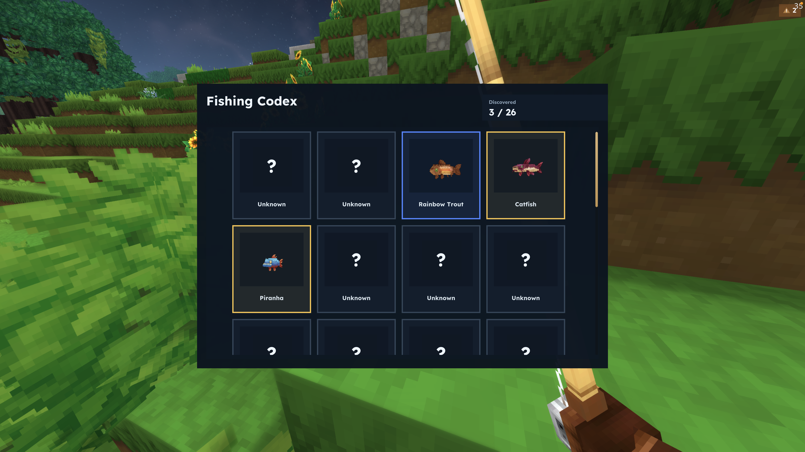
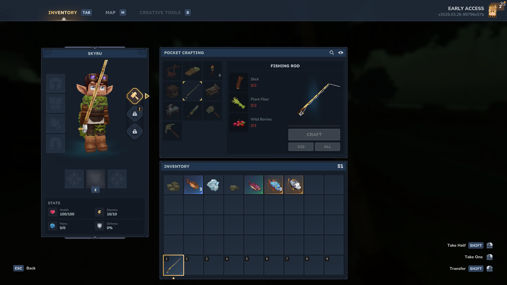

# Tiny Fishing

Tiny Fishing is a focused Hytale fishing mod built around a short, cozy and readable loop.

Cast into water, wait for the bite, reel at the right time, and slowly fill out a codex of fish across different regions. Fish'em all!


## Highlights

- simple cast, wait, and reel fishing flow
- no fishing minigame
- fixed-slot Fishing Codex with hidden gaps to fill over time
- codex built around the vanilla fish currently available in Hytale
- fish are split across different zones and biomes, so completing the codex requires travelling through different environments
- codex content will continue to be updated as new vanilla fish are added to Hytale
- new fish and new best quality discovery alerts
- fish quality tracking for codex progression
- region-based fish and trash tables
- global prize pool with gems, ores, and eternal crop seeds
- codex access directly from the rod in-game

## Download

Tiny Fishing is also available on CurseForge.

CurseForge page: link to be added.

## How To Fish

1. Equip the `Fishing Rod`.
2. Cast into water.
3. Wait for the bite splash and sound.
4. Reel during the bite window.
5. Catch fish, trash, or a prize.

## How To Open The Codex

This is the easiest interaction to miss and the most important control to know:

1. Hold the `Fishing Rod`.
2. Aim away from water.
3. Right-click.

That opens the Fishing Codex.

If you are aiming at water, you will cast instead of opening it.

There is also a fallback command:

- `/tf codex`




## Fishing Codex

- the codex is made up of the vanilla fish currently available in Hytale
- it is intended to keep expanding as vanilla adds more fish over time
- right now, completing it means visiting different environments because fish are separated by zone and biome
- every fish has a fixed slot
- undiscovered fish stay hidden as gaps
- codex order is fixed by region instead of discovery time
- border color reflects the best quality you have ever caught for that fish
- filling missing slots is part of the progression and discovery loop

## Loot Balance

- fish: `70%`
- trash: `20%`
- prize: `10%`

Prize items are selected from a uniform global pool.

## Crafting

The `Fishing Rod` is crafted in "Pocket crafting" with:

- `Stick x2`
- `Fibre x2`
- `Wild Berries x1`



## Commands

- `/tf codex`
- `/tf reset`

## Installation

1. Download the latest `tiny-fishing` jar.
2. Place it in your world's `mods` folder.
3. Start or reload the world.

## Release Notes

Current version: `1.0`

See also:

- `CHANGELOG.md`
- `docs/release/RELEASE_NOTES_1.0.md`

## License

Licensed under the Apache License 2.0.

You are free to use, modify, and redistribute this project, including derivative works, as long as the Apache 2.0 license text and attribution notices are preserved.

See:

- `LICENSE`
- `NOTICE`

## Development

Prerequisites:

- local `HytaleServer.jar`
- Java 25 available to Gradle toolchains

Useful commands:

```bash
./gradlew compileJava
./gradlew test
./gradlew jar
./gradlew deployToHytaleSaveMods
```

Override local paths with:

- `-Dhytale.server.jar=/path/to/HytaleServer.jar`
- `-Dhytale.save.mods.dir=/path/to/save/mods`

Development notes live in:

- `docs/dev/DESIGN.md`
- `docs/dev/CONTENT_GUIDE.md`
- `docs/dev/TECHNICAL.md`
